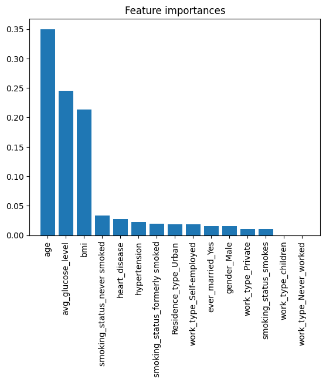
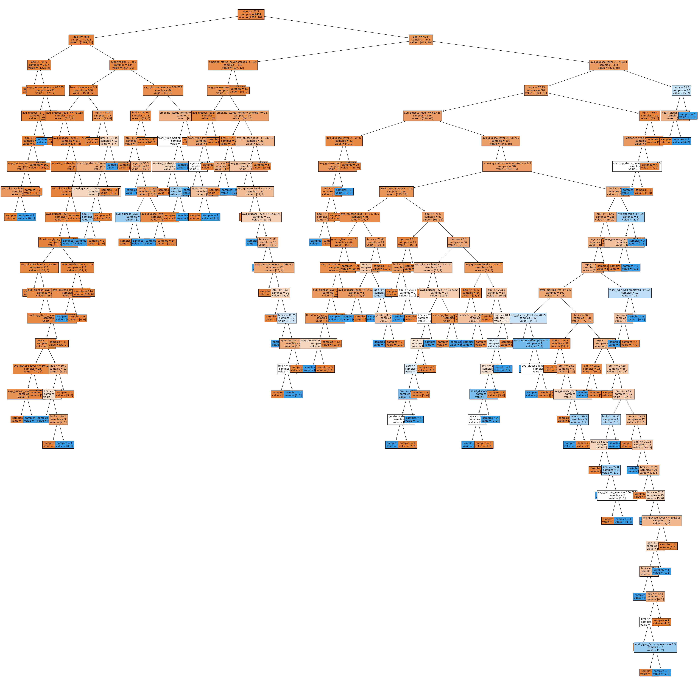
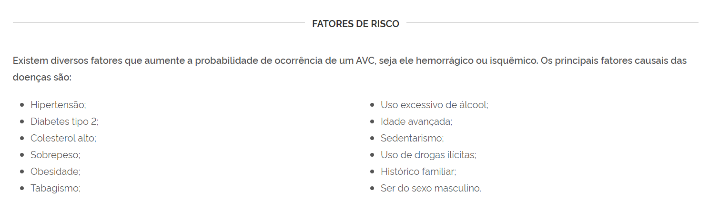

# Álgebra Linear - APS 6 - 2024.1 [Insper](https://www.insper.edu.br/pt/home)

## Autores do Projeto
- [Ian Cordibello Desponds](https://github.com/iancdesponds)
- [Luigi Orlandi Quinze](https://github.com/guizin-15)

# [Projeto - Predição de AVCs](https://github.com/iancdesponds/algebra-linear-predicao-avc)

## Descrição do Projeto
Neste projeto, vamos usar classificadores para identificar *quais são os fatores de risco para o acidente vascular cerebral (AVC)*. Um AVC (*stroke*) é um dano cerebral causado pela interrupção de seu fluxo sanguíneo. Ter um AVC é um problema sério porque pode levar a sequelas, então é melhor preveni-lo do que tentar lidar com suas consequências.

Temos à nossa disposição um conjunto de dados para [predição de AVCs](https://www.kaggle.com/datasets/fedesoriano/stroke-prediction-dataset). O que faremos é:

1. Treinar um classificador para predizer se houve ou não houve AVCs
1. Verificar a acurácia do classificador
1. Identificar quais são os fatores que mais provavelmente estão ligados a ter AVCs

# Metodologia
## Preparação dos Dados
Inicialmente, realizamos uma exploração detalhada dos dados, tratando valores nulos e convertendo variáveis categóricas em numéricas usando one-hot encoding. Além disso, removemos entradas irrelevantes, como pacientes com gênero indefinido.

## Treinamento dos Classificadores
Implementamos dois tipos de classificadores: linear e por árvore de decisão. Utilizamos a biblioteca `scikit-learn` para treinar o classificador por árvore de decisão e a biblioteca `autograd` para implementar o classificador linear. Dividimos o conjunto de dados em conjuntos de treinamento e teste para avaliar o desempenho dos classificadores.

## Identificação de Fatores de Risco
Utilizando o classificador por árvore de decisão, identificamos as features mais importantes que influenciam suas decisões. Isso nos permitiu identificar os fatores de risco mais significativos para AVCs.
- Feature ranking:
1. feature age (0.3499933418285907)
2. feature avg_glucose_level (0.24471430493037893)
3. feature bmi (0.2137021033133531)
4. feature smoking_status_never smoked (0.03351628942080602)
5. feature heart_disease (0.027268676679915834)
6. feature hypertension (0.02192993412985248)
7. feature smoking_status_formerly smoked (0.019675294555933785)
8. feature Residence_type_Urban (0.01861557092042416)
9. feature work_type_Self-employed (0.01793508968324181)
10. feature ever_married_Yes (0.015675099636484724)
11. feature gender_Male (0.015652911321309606)
12. feature work_type_Private (0.010786186925126883)
13. feature smoking_status_smokes (0.010535196654581988)
14. feature work_type_children (0.0)
15. feature work_type_Never_worked (0.0)

## Árvore de decisão
Árvore de decisão criada usando o pacote `sklearn`:

                

## Avaliação dos Classificadores
Para avaliar o desempenho dos classificadores, calculamos a acurácia, comparando as previsões dos classificadores com os resultados reais. Também comparamos a acurácia dos classificadores com a acurácia de um modelo de referência que sempre chuta a classe mais frequente (neste caso, a classe "não teve AVC").
Ao comparar o nosso classificador com o modelo que sempre chuta a classe mais frequente, percebemos que o nosso classificador, apesar de ter uma acurácia de aproximadamente `90%`, não é tão eficaz quanto o modelo de referência, que possui eficácia de `95%`. Isso ocorre porque o conjunto de dados é desbalanceado, com poucos casos de AVCs. Portanto, entendemos que o classificador criado não é eficaz para prever AVCs, apesar de ter uma acurácia aparentemente alta.

## Resultados Principais
- O classificador por árvore de decisão obteve uma acurácia aproximada de 92%, enquanto o classificador linear atingiu cerca de `90%`.
- Os fatores de risco identificados incluem idade, histórico de tabagismo, pressão arterial elevada, entre outros.
- Ao comparar o desempenho dos classificadores com um modelo de referência que sempre chuta a classe mais frequente, observamos que nosso classificador não foi tão eficaz quanto o modelo de referência, devido ao desbalanceamento do conjunto de dados. Enquanto nosso classificador teve uma acurácia de aproximadamente `90%`, o modelo de referência alcançou uma eficácia de `95%`, o que indica que, nesse caso, o classificador não é eficaz para prever AVCs.

## Validação com Referências Bibliográficas
Para validar nossas descobertas, procuramos estudos científicos anteriores sobre AVCs para verificar se os fatores de risco identificados pelos classificadores já foram relatados na literatura médica.
No site do [Ministério da Saúde](https://www.gov.br/saude/pt-br), encontramos um [artigo](https://www.gov.br/saude/pt-br/assuntos/saude-de-a-a-z/a/avc) que mostra fatores de risco para AVCs, como idade, pressão arterial elevada, tabagismo e diabetes. Esses fatores de risco são semelhantes aos identificados pelos classificadores, que está de acordo com nossas descobertas.

## Como Executar o Projeto
Para executar o projeto, siga as instruções abaixo:
1. Clone o repositório em sua máquina local
1. Instale as dependências necessárias executando `pip install -r requirements.txt`
1. Execute o notebook `main.ipynb` para ver o código completo e comentado, incluindo a execução de todos os testes e análises realizadas neste projeto.
